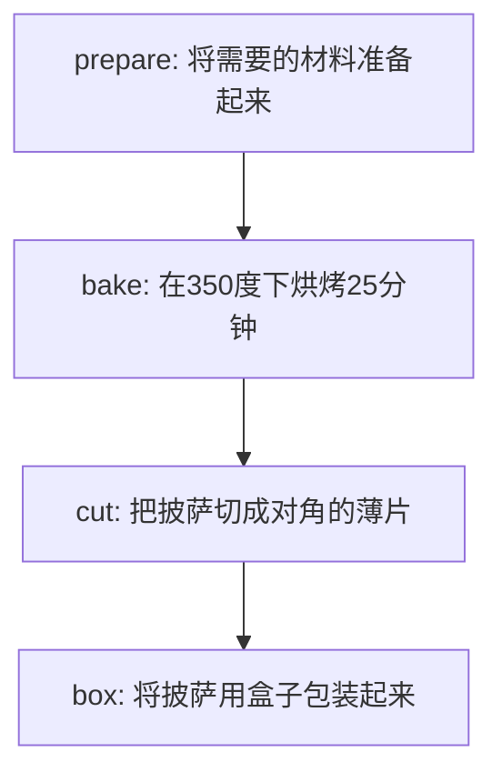

# 简单工厂模式
### 概念： `将创建对象的行为封装起来 只通过简单的参数来获取对象`;

## 开一家披萨店（示例场景）：
    使用 简单工厂将披萨的制作过程都封装起来 根据不同的披萨类型制作不同的披萨

#### 披萨种类：
- 芝士披萨（cheese）
- 火腿披萨（pepperoni）
- 蛤蜊披萨（clam）
- 蔬菜披萨（veggie）

#### 披萨店的制作过程:

```mermaid
    graph TD
    prepare[prepare: 将需要的材料准备起来]
    bake[bake: 在350度下烘烤25分钟]
    cut[cut: 把披萨切成对角的薄片]
    box[box: 将披萨用盒子包装起来]
    prepare --> bake
    bake --> cut 
    cut --> box
```
