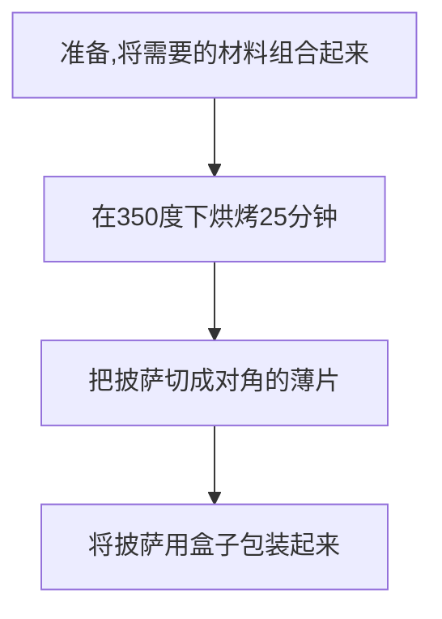

# 简单工厂模式
概念： `将创建对象的行为封装起来 只通过简单的参数来获取对象`;

### 示例场景：
    开一家披萨店。
    
### 披萨种类：
    芝士披萨
    火腿披萨
    蛤蜊披萨
    蔬菜披萨

### 披萨店的制作过程:

```mermaid
flowchart TD
    准备,将需要的材料组合起来  -->  在350度下烘烤25分钟 --> 把披萨切成对角的薄片 --> 将披萨用盒子包装起来
```
`使用 简单工厂将这些过程都封装起来 根据不同的披萨类型获取不同的披萨`
