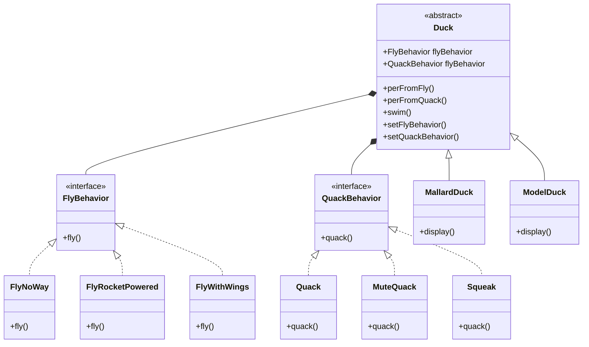

# DUCK 类图
    使用 typore 打开

```mermaid
classDiagram
	FlyBehavior <|.. FlyNoWay
	FlyBehavior <|.. FlyRocketPowered
	FlyBehavior <|.. FlyWithWings
	QuackBehavior <|.. Quack
	QuackBehavior <|.. MuteQuack
	QuackBehavior <|.. Squeak
	Duck *-- FlyBehavior
	Duck *-- QuackBehavior
	Duck <|-- MallardDuck
	Duck <|-- ModelDuck
	class Duck{
		<<abstract>>
		+FlyBehavior flyBehavior
		+QuackBehavior flyBehavior
		+perFromFly()
		+perFromQuack()
		+swim()
		+setFlyBehavior()
		+setQuackBehavior()
	}
	class FlyBehavior{
		<<interface>>
		 +fly()
	}
	class QuackBehavior{
		<<interface>>
		+quack()
	}
	class FlyNoWay{
		 +fly()
	}
	class FlyRocketPowered{
		 +fly()
	}
	class FlyWithWings{
		 +fly()
	}
	class Quack{
		+quack()
	}
	class MuteQuack{
		+quack()
	}
	class Squeak{
		+quack()
	}
	class MallardDuck{
		+display()
	}
	class ModelDuck{
		+display()
	}

```

